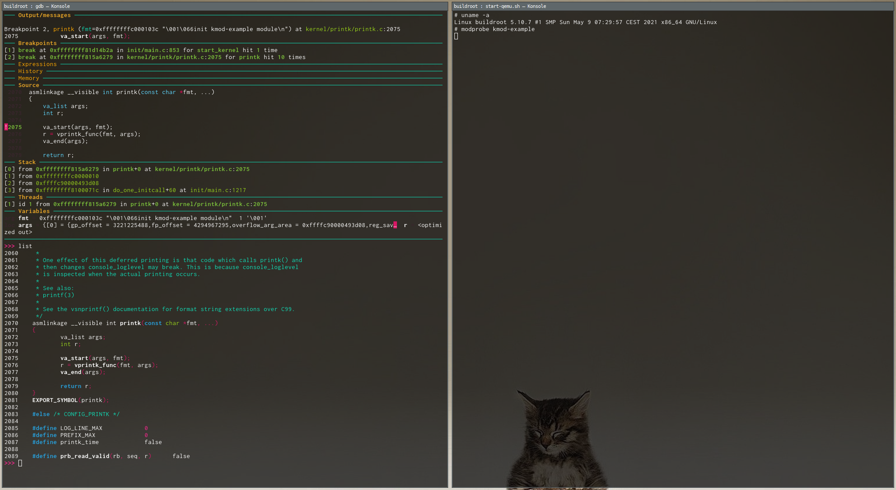

# br2-external-kernel-dev-lab

## A buildroot out-of-tree kernel dev lab

This repository is just a minimal *Buildroot* out-of-tree solution to setup a kernel dev lab using Qemu.



### How to use:
Clone this repository:
```sh
$ git clone https://github.com/sbourdelin/br2-external-kernel-dev-lab.git
```

Go to your main *Buildroot* folder, and add the root folder of this external repository:
```sh
$ make BR2_EXTERNAL=<path>/br2-external-kernel-dev-lab
```

You can now use the new board *qemu_x86_64_debug_defconfig*, which will create a qemu ready image with debug symbols and facilities for debugging:
```sh
$ make qemu_x86_64_debug_defconfig
```

Start the qemu machine using the generated start-qemu.sh script:
```sh
$ ./output/images/start-qemu.sh
```

Qemu is now waiting for a GDB connection on port 1234 before starting the kernel.
You can start GDB with the compiled vmlinux file to get the symbols.
```sh
$ gdb ./output/build/<linux-path>/vmlinux

(gdb) target remote :1234
(gdb) continue
```

The linux gdb scripts are also available:
```sh
(gdb) apropos lx-
```
